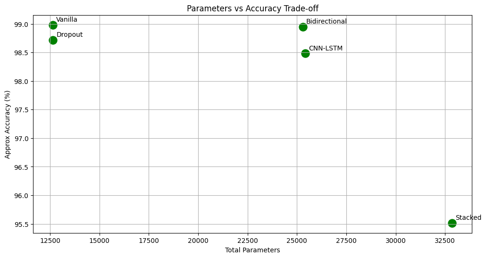
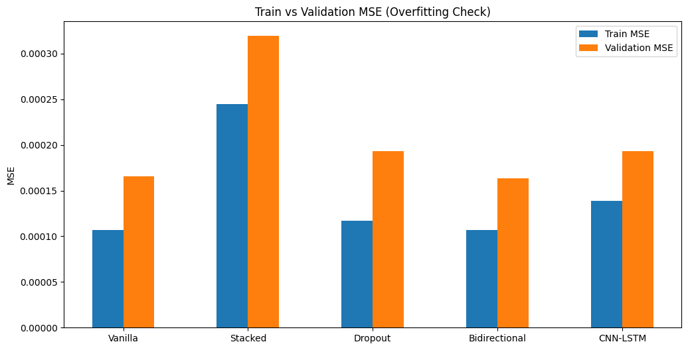
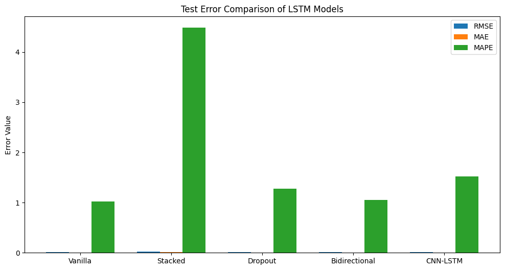
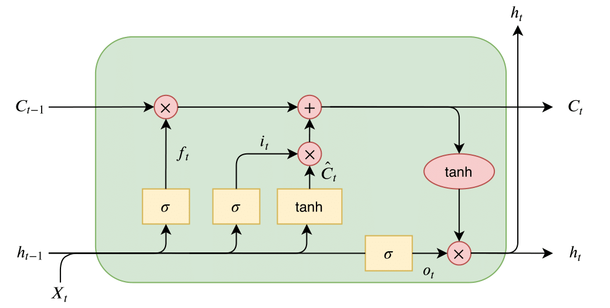

# Electricity Demand Forecasting - LSTM Models Comparison ⚡


## 📘 Project Overview

This project presents a **comprehensive comparative study of LSTM-based deep learning models** for **short-term electricity demand forecasting** using **hourly power consumption data (2021–2024)**.

The study follows the **CRISP-DM (Cross-Industry Standard Process for Data Mining)** methodology and evaluates **five different LSTM architectures** under identical experimental conditions.

**Key Insight:**  
A **Vanilla LSTM** model outperforms more complex architectures, proving that **higher model complexity does not necessarily improve forecasting accuracy** for real-world power systems.

---

## 🎯 Objectives

- Forecast **1-hour ahead electricity demand**
- Compare multiple **LSTM architectures**
- Capture **seasonal and temporal patterns**
- Evaluate **generalization and stability**
- Provide **deployment-ready insights** for smart grids

---

## 🏗️ CRISP-DM Workflow

1. **Business Understanding** – Power system forecasting  
2. **Data Understanding** – Hourly load data (2021–2024)  
3. **Data Preparation** – Cleaning, normalization, feature engineering  
4. **Modeling** – LSTM-based deep learning architectures  
5. **Evaluation** – Multi-metric performance analysis  
6. **Deployment Planning** – Real-time forecasting feasibility  

---

## 🧠 Models Implemented

- Vanilla LSTM  
- Stacked LSTM  
- Dropout LSTM  
- Bidirectional LSTM  
- CNN–LSTM Hybrid  

---

## 📊 Evaluation Metrics

The models are evaluated using **30+ performance metrics**, including:

- Mean Squared Error (MSE)
- Root Mean Squared Error (RMSE)
- Mean Absolute Error (MAE)
- Mean Absolute Percentage Error (MAPE)
- Symmetric MAPE (sMAPE)
- R² Score
- Overfitting Gap
- Robustness Ratio
- Monthly & seasonal error analysis

---

## 🏆 Key Results (Test Set)

| Model | RMSE | MAE | MAPE (%) | Parameters |
|------|------|------|----------|------------|
| **Vanilla LSTM** | **0.01044** | **0.00399** | **1.017** | **12,651** |
| Stacked LSTM | 0.01816 | 0.01498 | 4.485 | 32,851 |
| Dropout LSTM | 0.01112 | 0.00511 | 1.280 | 12,651 |
| Bidirectional LSTM | 0.01050 | 0.00411 | 1.049 | 25,301 |
| CNN-LSTM | 0.01190 | 0.00612 | 1.518 | 25,419 |

---

## 📈 Visualizations

### 1. Monthly Comparison: Actual vs Predicted

*Month-wise power demand comparison showing actual 2023 vs predicted 2024 values*

### 2. Model Performance Analysis

*Trade-off between model complexity (parameters) and accuracy for different LSTM architectures*

### 3. Overfitting Analysis

*Comparison of training and validation MSE across different model architectures*

### 4. Test Error Comparison

*Test error values for Vanilla, Stacked, Dropout, Bidirectional, and CNN-LSTM models*

### 5. Monthly Average Demand

*Monthly average power demand comparison between actual and predicted values*

### 6. LSTM Cell Architecture

*Internal structure of an LSTM cell showing gates and connections*

### 7. January 2024 Forecast

*Detailed daily/hourly forecast for January 2024 compared to actual 2023 data*

### 8. February 2024 Forecast

*Detailed daily/hourly forecast for February 2024*

### 9. Annual Comparison

*Complete year comparison showing 2023 actual data vs 2024 predictions*

---

## 🏗️ Project Structure

```
Electricity-demand-forecasting-AIML/
│
├── images/
│   ├── month wise actual predicted 2024.png
│   ├── params_vs_accuracy.png
│   ├── overfitting.png
│   ├── error_comparison.png
│   ├── Monthly Average Power Demand.png
│   ├── lstm_cell.png.png
│   ├── jan 2024 predicted.png
│   ├── feb 2023 predicted.png
│   └── actual 2023 vs predicted 2024.png
│
├── models/
│   ├── vanilla_lstm.py
│   ├── stacked_lstm.py
│   ├── dropout_lstm.py
│   ├── bidirectional_lstm.py
│   └── cnn_lstm.py
│
├── data/
│   ├── power_demand_2021_2024.csv
│   ├── preprocessing.py
│   └── feature_engineering.py
│
├── notebooks/
│   ├── exploratory_analysis.ipynb
│   ├── model_training.ipynb
│   └── results_analysis.ipynb
│
├── evaluation/
│   ├── metrics_calculation.py
│   └── performance_analysis.py
│
├── requirements.txt
├── train.py
├── predict.py
└── README.md
```

---

## 🚀 Quick Start

```bash
# Clone repository
git clone https://github.com/Danieljoshua720/Electricity-demand-forecasting-AIML.git
cd Electricity-demand-forecasting-AIML

# Install dependencies
pip install -r requirements.txt

# Run training
python train.py --model vanilla_lstm --epochs 100

# Make predictions
python predict.py --model trained_models/vanilla_lstm.h5 --data test_data.csv
```

---

## ⚙️ Tech Stack

- **Language:** Python 3.9+
- **Frameworks:** TensorFlow 2.9, Keras
- **Data Processing:** NumPy, Pandas, Scikit-learn
- **Visualization:** Matplotlib, Seaborn
- **Methodology:** CRISP-DM
- **Development:** Jupyter Notebook, Git, VS Code

---

## 📋 Dependencies

```
tensorflow==2.9.0
keras==2.9.0
pandas==1.4.0
numpy==1.22.0
matplotlib==3.5.0
seaborn==0.11.0
scikit-learn==1.1.0
jupyter==1.0.0
```

---

## 🔧 Key Features

- **Multiple LSTM Architectures:** 5 different LSTM variants for comparison
- **Comprehensive Visualization:** 9 different visualization types
- **Overfitting Analysis:** Detailed train vs validation performance
- **Error Metrics:** 30+ evaluation metrics including RMSE, MAE, MAPE
- **Time-Series Forecasting:** Hourly, daily, and monthly predictions
- **Real-world Dataset:** Delhi power consumption data (2021-2024)

---

## 📝 How to Use

1. Clone the repository
2. Install dependencies from `requirements.txt`
3. Run the training script to reproduce results
4. View generated visualizations in the `images/` directory
5. Modify model parameters in respective Python files
6. Use Jupyter notebooks for exploratory analysis

---

## 📄 License

This project is licensed under the MIT License - see the LICENSE file for details.

---

## 👥 Contributors

- **Daniel N** - Project Lead & Developer
- 

## 🙏 Acknowledgments

- Data sourced from From kaggle 
- Inspired by IEEE conference papers on power demand forecasting
- Thanks to the open-source community for TensorFlow/Keras

---

## 📬 Contact

For questions or collaborations, please contact:
- **GitHub:** [Danieljoshua720](https://github.com/Danieljoshua720)
- **Email:** [2005daniel2710@gmail.com]

