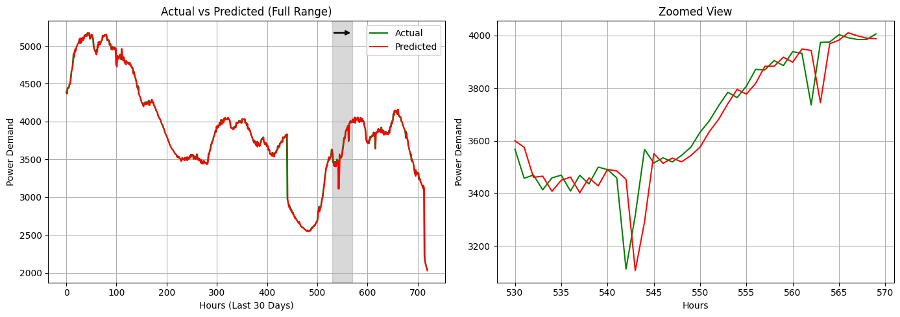

# Electricity-demand-forecasting-AIML

## 📘 Project Overview

This project presents a **comprehensive comparative study of LSTM-based deep learning models** for **short-term electricity demand forecasting** using **Delhi’s hourly power consumption data (2021–2024)**.

The study follows the **CRISP-DM (Cross-Industry Standard Process for Data Mining)** methodology and evaluates **five different LSTM architectures** under identical experimental conditions.

**Key Insight:**  
A **Vanilla LSTM** model outperforms more complex architectures, proving that **higher model complexity does not necessarily improve forecasting accuracy** for real-world power systems.

---

## 🎯 Objectives

- Forecast **1-hour ahead electricity demand**
- Compare multiple **LSTM architectures**
- Capture **seasonal and temporal patterns**
- Evaluate **generalization and stability**
- Provide **deployment-ready insights** for smart grids

---

## 🏗️ CRISP-DM Workflow

1. **Business Understanding** – Power system forecasting for Delhi  
2. **Data Understanding** – Hourly load data (2021–2024)  
3. **Data Preparation** – Cleaning, normalization, feature engineering  
4. **Modeling** – LSTM-based deep learning architectures  
5. **Evaluation** – Multi-metric performance analysis  
6. **Deployment Planning** – Real-time forecasting feasibility  

---

## 🧠 Models Implemented

- Vanilla LSTM  
- Stacked LSTM  
- Dropout LSTM  
- Bidirectional LSTM  
- CNN–LSTM Hybrid  

---

## 📊 Evaluation Metrics

The models are evaluated using **30+ performance metrics**, including:

- Mean Squared Error (MSE)
- Root Mean Squared Error (RMSE)
- Mean Absolute Error (MAE)
- Mean Absolute Percentage Error (MAPE)
- Symmetric MAPE (sMAPE)
- R² Score
- Overfitting Gap
- Robustness Ratio
- Monthly & seasonal error analysis

---

## 🏆 Key Results (Test Set)

| Model | RMSE | MAE | MAPE (%) | Parameters |
|------|------|------|----------|------------|
| **Vanilla LSTM** | **0.01044** | **0.00399** | **1.017** | **12,651** |
| Stacked LSTM | 0.01816 | 0.01498 | 4.485 | 32,851 |
| Dropout LSTM | 0.01112 | 0.00511 | 1.280 | 12,651 |
| Bidirectional LSTM | 0.01050 | 0.00411 | 1.049 | 25,301 |
| CNN-LSTM | 0.01190 | 0.00612 | 1.518 | 25,419 |

---

## 📈 Visualizations

- Actual vs Predicted Load (Hourly, Daily, Monthly)
- Seasonal demand analysis
- Monthly R² stability
- Error distribution (MAE, RMSE)
- 30-day rolling forecast
- Complexity vs accuracy trade-off
- Overfitting analysis

---

## ⚙️ Tech Stack

- **Language:** Python 3.9+
- **Frameworks:** TensorFlow 2.9, Keras
- **Data Processing:** NumPy, Pandas
- **Visualization:** Matplotlib, Seaborn
- **Methodology:** CRISP-DM
